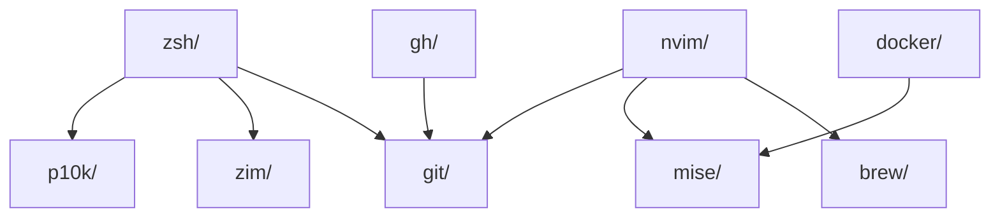

# 🗺️ dotfiles CONFIG_MAP

> 家目录配置的一站式索引。每个 stow 包 = 一组配置文件。
> 部署命令：`cd ~/dotfiles && ./configure link`
> 健康检查：`./configure doctor`

---

## 架构总览

```
~/dotfiles/
├── configure          ← 部署入口（stow 包装/卸/查）
├── justfile           ← 任务编排（lint/fix/verify/update）
├── README.md          ← 项目说明
├── CONFIG_MAP.md      ← 本文档
├── AGENTS.md          ← AI 助手指令
├── setup-mac.sh       ← macOS 一键安装
├── TUTORIAL.md        ← 教程
│
├── zsh/               ← 💻 Shell 环境
├── p10k/              ← 🎨 提示符主题
├── zim/               ← 📦 ZSH 模块管理器
├── git/               ← 🔧 版本控制
├── npm/               ← 📦 Node 包管理
├── pip/               ← 🐍 Python 包管理
│
├── ghostty/           ← 🖥️ 终端模拟器
├── zellij/              ← 🔳 终端复用器
├── yazi/              ← 📁 文件管理器
├── btop/              ← 📊 系统监控
├── fastfetch/         ← ℹ️ 系统信息
├── lazygit/           ← 🔧 Git TUI
│
├── nvim/              ← ✏️ 主力编辑器
├── mise/              ← 🏃 运行时版本管理
├── docker/            ← 🐳 OrbStack + Docker Compose 编排
├── manifests/         ← 📋 软件、配置面和 Hermes profile 清单
├── scripts/           ← 🩺 inventory、config audit、doctor、文档和 dry-run 清理
├── brew/              ← 🍺 Homebrew 包声明
├── opencode/          ← 🤖 AI 编码助手
├── claude/            ← 🤖 Claude Code 配置
├── local-bin/         ← 🩺 dotfiles 统一 CLI 入口
│
└── gh/                ← 🐙 GitHub CLI
```

---

## 详细包索引

### 💻 Shell 环境

#### `zsh/` — ZSH 配置
| 元数据 | 值 |
|--------|-----|
| 部署路径 | `~/.zshenv` → `dotfiles/zsh/.zshenv` |
| | `~/.zprofile` → `dotfiles/zsh/.zprofile` |
| | `~/.zshrc` → `dotfiles/zsh/.zshrc` |
| | `~/.zsh/` → `dotfiles/zsh/.zsh/`（目录 symlink） |
| 用途 | Shell 初始化环境，3 个标准入口 + 3 个职责模块 |
| 技术要点 | 环境变量从 Keychain 懒加载；proxy/zen-proxy 函数 |

**模块文件：** `~/.zsh/`

| 文件 | 用途 |
|------|------|
| `aliases.zsh` | 命令别名和安全默认值 |
| `functions.zsh` | 自定义函数、按需 Keychain 和服务管理 |
| `integrations.zsh` | fzf、zoxide、mise、direnv 等工具集成 |

#### `p10k/` — Powerlevel10k 提示符
| 元数据 | 值 |
|--------|-----|
| 部署路径 | `~/.p10k.zsh` → `dotfiles/p10k/.p10k.zsh` |
| 用途 | ZSH 提示符配置（Pure 风格 + transient prompt） |
| 依赖 | `zsh/` 加载 p10k 插件 |

#### `zim/` — Zim 模块管理器
| 元数据 | 值 |
|--------|-----|
| 部署路径 | `~/.zimrc` → `dotfiles/zim/.zimrc` |
| 用途 | 声明 Zim 模块清单 |
| 依赖 | 安装：`zimfw install` |

---

### 🔧 版本控制与包管理

#### `git/` — Git 配置
| 元数据 | 值 |
|--------|-----|
| 部署路径 | `~/.gitconfig` → `dotfiles/git/.gitconfig` |
| | `~/.gitignore_global` → `dotfiles/git/.gitignore_global` |
| 用途 | 全局 Git 配置 + 全局 gitignore |
| 技术要点 | delta diff 分页器；SSH insteadOf 别名；proxy 配置 |

#### `npm/` — Node.js 包管理
| 元数据 | 值 |
|--------|-----|
| 部署路径 | `~/.npmrc` → `dotfiles/npm/.npmrc` |
| 用途 | npmjs.org 官方 registry；地区镜像在项目级覆盖 |

#### `pip/` — Python 包管理
| 元数据 | 值 |
|--------|-----|
| 部署路径 | `~/.config/pip/pip.conf` → `dotfiles/pip/.config/pip/pip.conf` |
| 用途 | pip 镜像源配置（清华源） |

---

### 🖥️ 终端工具

#### `ghostty/` — 终端模拟器（主力）
| 元数据 | 值 |
|--------|-----|
| 部署路径 | `~/.config/ghostty/config` → `dotfiles/ghostty/.config/ghostty/config` |
| 用途 | GPU 加速终端，macOS 毛玻璃效果 |
| 技术要点 | Maple Mono NF 14pt；Tokyo Night Storm；`option-as-alt = true` |

#### `zellij/` — 终端复用器（主力）
| 元数据 | 值 |
|--------|-----|
| 部署路径 | `~/.config/zellij/config.kdl` → `dotfiles/zellij/.config/zellij/config.kdl` |
| 用途 | 终端会话管理 |
| 技术要点 | 原生 Zellij 模式；鼠标支持；滚动缓冲 |

### 📁 文件管理 & 系统工具

#### `yazi/` — 终端文件管理器
| 元数据 | 值 |
|--------|-----|
| 部署路径 | `~/.config/yazi/yazi.toml` → `dotfiles/yazi/.config/yazi/yazi.toml` |
| 用途 | Vim 风格文件浏览 |

#### `btop/` — 系统监控
| 元数据 | 值 |
|--------|-----|
| 部署路径 | `~/.config/btop/btop.conf` → `dotfiles/btop/.config/btop/btop.conf` |
| 用途 | CPU/内存/磁盘/GPU 实时监控 |

#### `fastfetch/` — 系统信息
| 元数据 | 值 |
|--------|-----|
| 部署路径 | `~/.config/fastfetch/config.jsonc` → `dotfiles/fastfetch/.config/fastfetch/config.jsonc` |
| | `~/.config/fastfetch/logo.txt` → `dotfiles/fastfetch/.config/fastfetch/logo.txt` |
| 用途 | 终端启动时显示系统信息（后台运行） |

#### `lazygit/` — Git TUI
| 元数据 | 值 |
|--------|-----|
| 部署路径 | `~/.config/lazygit/config.yml` → `dotfiles/lazygit/.config/lazygit/config.yml` |
| 用途 | 可视化 Git 操作 |

---

### ✏️ 编辑器

#### `nvim/` — Neovim（主力编辑器）
| 元数据 | 值 |
|--------|-----|
| 部署路径 | `~/.config/nvim/` → `dotfiles/nvim/.config/nvim/`（目录 symlink） |
| 用途 | 54 个插件，完整的 IDE 体验 |
| 技术要点 | lazy.nvim；blink.cmp 补全；avante.nvim AI 聊天；supermaven 内联补全 |

**核心文件：**
| 文件 | 用途 |
|------|------|
| `init.lua` | 入口，lazy.nvim 引导 |
| `lua/core/options.lua` | 编辑器选项 |
| `lua/core/keymaps.lua` | 全局快捷键 |
| `lua/plugins/init.lua` | 插件声明 |
| `lua/plugins/*.lua` | 各插件配置（分 22 个模块） |

---

### 🏃 运行时 & 容器

#### `mise/` — 运行时版本管理
| 元数据 | 值 |
|--------|-----|
| 部署路径 | `~/.config/mise/config.toml` → `dotfiles/mise/.config/mise/config.toml` |
| 用途 | 管理 Node 22 + Python 3.12 |
| 命令 | `mise install` 一键安装 |

#### `docker/` — OrbStack + Docker Compose 编排
| 元数据 | 值 |
|--------|-----|
| 文件 | `docker-compose-ai.yml`、`litellm_config.yaml` |
| 用途 | Qdrant 默认向量库；LiteLLM (`llm`) 按 profile 启用 |
| 前置 | OrbStack 正在运行且 `docker context show` 为 `orbstack` |

#### `manifests/` — 软件与 AI 生命周期清单

| 文件 | 用途 |
|------|------|
| `software.tsv` | 软件来源、状态、命令和配置路径 |
| `ai-profiles.tsv` | Hermes Studio 调度关系和 profile 生命周期 |
| `config-surface.tsv` | 家目录托管、运行态和 legacy 路径边界 |

#### `scripts/` — 系统控制面

| 命令 | 用途 |
|------|------|
| `scripts/dotfiles inventory` | 生成脱敏系统清单 |
| `scripts/dotfiles doctor` | 检查 Stow、OrbStack、Compose、mise |
| `scripts/dotfiles hermes` | 审计 Hermes profile、运行时和敏感文件权限 |
| `scripts/dotfiles config` | 审计托管、运行态和 legacy 配置路径 |
| `scripts/dotfiles docs` | 更新 Obsidian 生成页面 |
| `scripts/dotfiles sync` | inventory + config + docs，一次同步系统状态 |
| `scripts/dotfiles cleanup` | 只显示清理候选，不删除内容 |

---

### 🍺 包管理

#### `brew/` — Homebrew 声明
| 元数据 | 值 |
|--------|-----|
| 部署路径 | `~/.Brewfile` → `dotfiles/brew/.Brewfile` |
| 用途 | 声明式 Homebrew 包管理 |
| 命令 | `brew bundle --file ~/.Brewfile` |

---

### 🤖 AI 工具

#### `claude/` — Claude Code 配置
| 元数据 | 值 |
|--------|-----|
| 部署路径 | `~/.claude/CLAUDE.md` → `dotfiles/claude/.claude/CLAUDE.md` |
| | `~/.claude/settings.json` → `dotfiles/claude/.claude/settings.json` |
| | `~/.claude/rules/` → `dotfiles/claude/.claude/rules/`（26 个规则文件） |
| | `~/.claude/skills/` → `dotfiles/claude/.claude/skills/`（38 个技能） |
| | `~/.claude/agents/` → `dotfiles/claude/.claude/agents/`（子智能体定义） |
| | `~/.claude/hooks/` → `dotfiles/claude/.claude/hooks/` |
| | `~/.claude/hud/` → `dotfiles/claude/.claude/hud/` |
| 用途 | Claude Code AI 编码助手配置（系统提示词、规则、技能、智能体） |
| 未纳入 | 运行时目录（cache/sessions/telemetry/plugins 等机器相关数据） |
| 注意 | 运行时的 `~/.claude.json` 保留在本机，不纳入 Stow |

#### `opencode/` — OpenCode 配置
| 元数据 | 值 |
|--------|-----|
| 部署路径 | `~/.config/opencode/opencode.jsonc` → `dotfiles/opencode/.config/opencode/opencode.jsonc` |
| 用途 | AI 编码助手配置 + 模型路由 |
| 技术要点 | Zen Proxy 免费模型；子智能体路由 |

运行态的 `~/.claude.json` 不纳入 Stow，也不复制到仓库。

### 🩺 系统控制面

#### `local-bin/` — dotfiles CLI
| 元数据 | 值 |
|--------|-----|
| 部署路径 | `~/.local/bin/dotfiles` → `dotfiles/local-bin/.local/bin/dotfiles` |
| 用途 | 从任意目录调用 inventory、config、doctor、audit、sync、docs、dry-run cleanup，以及兼容的 `dev` 运行时入口 |
| 依赖 | `DOTFILES_ROOT`，默认 `~/dotfiles` |

`~/.local/bin/dev` 现在也是 Stow 管理的兼容入口；`dev reset` 只调用 `dotfiles cleanup`，不会删除容器/模型或重启服务。旧版本保留为 `~/.local/bin/dev.legacy-*`，确认无回滚需求后再处理。

### 归档边界

`~/Archives/dotfiles-legacy/20260805` 保存本轮隔离的旧 Colima 数据、无项目归属的 scratch 文件和已迁移的旧方案。归档目录不由 Stow 管理，也不会被 `dotfiles cleanup` 自动删除。

### 🐙 其他工具

#### `gh/` — GitHub CLI
| 元数据 | 值 |
|--------|-----|
| 部署路径 | `~/.config/gh/config.yml` → `dotfiles/gh/.config/gh/config.yml` |
| | `~/.config/gh/hosts.yml` → `dotfiles/gh/.config/gh/hosts.yml` |
| 用途 | GitHub CLI 配置 |

---

## 跨包依赖图



### 快速对应：Brew 公式 → Dotfiles 包

| Brew 公式 | 对应的 dotfiles 包 |
|-----------|-------------------|
| `neovim` | nvim/ |
| `stow` | 全部（管理工具本身）|
| `zellij` | zellij/ |
| `btop` | btop/ |
| `fastfetch` | fastfetch/ |
| `lazygit` | lazygit/ |
| `yazi` | yazi/ |
| `gh` | gh/ |
| `mise` | mise/ |
| `just` | justfile（非 stow）|
| `git` | git/ |
| `ghostty` | ghostty/ |

---

## CLI 快速查找

```bash
# 想知道某个配置在哪？
ls -la ~/dotfiles/<包名>/
# 例：ls -la ~/dotfiles/zsh/

# 查看哪些 symlink 已部署
./configure doctor

# 搜索配置内容
rg "关键字" ~/dotfiles/ --type-add 'dot:*.{zsh,lua,conf,toml,yml,yaml,json,jsonc,cfg,ini,kdl}'

# 查看包文件清单
./configure list
```

## 维护备忘

| 操作 | 命令 |
|------|------|
| 新增 stow 包 | `mkdir -p dotfiles/<pkg>/.config/<pkg>` + `stow <pkg>` |
| 删除 stow 包 | `stow -D <pkg>` + 删除目录 + 从 `configure` PACKAGES 移除 |
| 重新部署 | `./configure reinstall` |
| 检查健康 | `./configure doctor` |
| 代码检查 | `just lint` |
| 自动修复 | `just fix` |
| 提交前验证 | `just verify` |

---

> **提示：** 看到一行不明配置？
> 1. `rg "关键字" ~/dotfiles/` 搜索来源
> 2. `ls -la ~/dotfiles/<包名>/` 查看文件
> 3. `readlink <symlink>` 追踪到 dotfiles 仓库
