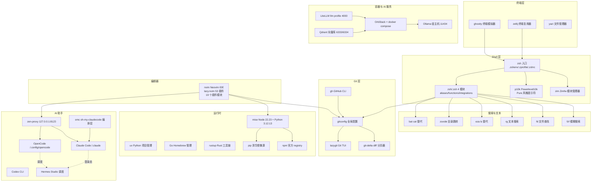

# TUTORIAL — dotfiles 安装与使用教程（手把手）

> 本教程与 `README.md`（目录说明）互补：README 回答「仓库里有什么」，本教程回答「怎么装、怎么用、怎么维护」。
> 适用环境：macOS（Apple Silicon，Arm 架构测试通过）；Intel Mac 大部分步骤同样适用（Homebrew 前缀换成 `/usr/local`）。
> 所有命令默认在仓库根目录 `~/dotfiles` 执行，配置统一 Tokyo Night Storm 配色。

---

## 0. 阅读约定

| 符号 | 含义 |
|------|------|
| `$` | 普通用户 shell 提示符（命令本身不含 `$`） |
| `# ...` | 注释说明，非命令 |
| `~/dotfiles/...` | 仓库内的路径 |
| `~/.config/...` | 部署到 `$HOME` 的路径（由 stow symlink 指回仓库）|
| **必须先做** | 跳过会导致后续步骤失败的前置条件 |

任何一条命令都可通过 `./configure doctor` 与 `just verify` 验证结果。

---

## 1. 环境拓扑总览

dotfiles 管理的是「终端 → 工具链 → 运行时 → AI 服务」的完整开发环境。依赖关系如下：



### 分层职责

| 层 | 组件 | 一句话职责 |
|----|------|-----------|
| 终端 | ghostty / zellij / yazi | GPU 渲染终端、会话管理、文件浏览 |
| Shell | zsh / zimfw / p10k | 启动环境、模块加载、提示符（transient + instant prompt）|
| 搜索 | fzf / fd / rg / eza / zoxide / bat | 一切指令行的「找与看」 |
| Git | gitconfig / delta / lazygit / gh | 全局 Git 行为 + 可视化操作 |
| 编辑器 | nvim | 主力 IDE（LSP/补全/Git/AI/调试）|
| 运行时 | mise / uv / rustup | 语言版本与依赖管理 |
| 容器 | OrbStack / compose / Ollama | AI 服务地基（Qdrant 向量库常驻）|
| AI | zen-proxy / claude / opencode / codex / omc | 三工具协同 + OMC 编排 |

### 包依赖关系（stow 包层面）

```
zsh/      → p10k/, zim/, git/
nvim/     → git/, mise/（LSP 运行时）
opencode/ → claude/（OMC 规则、技能、agents）
docker/   → brew/（工具安装来源）
gh/       → git/（仓库协作与认证一致）
auto-review/ → 无（纯本地 python3，零外部依赖）
```

---

## 2. 快速开始（两条路线）

> **隐私前提**：下列路线只会装好「骨架」。API 密钥、GitHub 认证、Claude Code 登录属于**机器私有信息**，脚本和教程只提供引导（见第 5 章），**不会也不应**被自动写入。
>
> **网络前提**：需要能访问 GitHub、Homebrew 公式源。国内网络建议先配置代理：`proxy on`（默认端口 7892，见 `prox/AGENTS.md`）。

### 路线 A：一键脚本（推荐新机器）

```bash
# 1. 克隆仓库（若 SSH key 未配置，用 https 代替 SSH）
git clone git@github.com:1764712542/dotfiles.git ~/dotfiles
cd ~/dotfiles

# 2. 一键安装（幂等、可重跑；隐私环节只输出引导信息）
bash setup-mac.sh
#   可选参数:
#     --force    强制更新已存在的项（uv tool --force、mise install --force 等）
#     --dry-run  只打印将要执行的命令，零副作用
#     --yes      全程自动确认，不询问
```

`setup-mac.sh`（9 个阶段，幂等可重跑）：

```
[前置] macOS / Apple Silicon / Command Line Tools / 网络连通
[1/9]  Homebrew 安装（官方 NONINTERACTIVE=1 脚本）
[2/9]  brew bundle --file brew/.Brewfile（幂等，已装自动跳过）
[3/9]  mise install（Node 22.23.0 + Python 3.12.13）
[4/9]  uv 安装 + uv tool install（aider-chat / huggingface-hub / jupyterlab /
       mcp-server-qdrant / nano-pdf）
[5/9]  部署 dotfiles（复用或克隆 ~/dotfiles，./configure link 部署 stow symlink）
[6/9]  zimfw install（Zim 模块）
[7/9]  nvim --headless "+Lazy! sync"（300s 超时，失败仅警告不致命）
[8/9]  验证：./configure doctor + scripts/dotfiles doctor
[9/9]  输出手动配置清单（gh auth login / Keychain API 密钥 / claude login /
       docker compose up 启动 Qdrant / 可选 just ollama）
```

> 隐私边界：脚本不写入、不读取任何 API 密钥/token/私钥；不触碰 `gh/.config/gh/hosts.yml`、`opencode/.claude.json`、`claude/.claude/CLAUDE.md` 与 `settings.json`；只读取 `brew/.Brewfile`、`mise/.config/mise/config.toml` 等清单，不修改；写入痕迹仅限 /tmp 临时文件，结束即删除。

### 路线 B：分步手动（适合想理解每步在做什么）

```bash
cd ~/dotfiles
./configure link       # 部署 stow symlink 到 $HOME
brew bundle --file brew/.Brewfile   # 安装 31 formulae + 9 casks
mise install           # 安装 Node 22.23.0 + Python 3.12.13
zimfw install          # 安装 Zim 模块
uv tool install <需要全局的 CLI>     # 按需
nvim                   # 首次启动自动 :Lazy! sync 装 53 个插件
exec zsh               # 重开 shell 让新 PATH/env 生效
```

两步路线的验收标准一致，见第 3 章阶段 9「验证」。

---

## 3. 分步安装详解

> 第 3 章按「手动安装的自然顺序」编排（CLT → Homebrew → brew bundle → configure link → mise → zimfw → uv tool → nvim → 隐私 → 验证）；`setup-mac.sh` 的阶段顺序略有不同（先 mise/uv 再部署 symlink），但内容一一对应，任选其一即可。

### 阶段 0：安装 Xcode Command Line Tools（CLT）

**为什么**：git、clang、make 等基础工具依赖 CLT；Homebrew 安装也要求 CLT 存在。

```bash
xcode-select --install
# 弹出图形窗口后点「安装」，等待完成
xcode-select -p   # 预期输出 /Library/Developer/CommandLineTools
```

> 若提示已安装（`xcode-select: error: command line tools are already installed` 或直接输出路径），说明 CLT 就绪，无需处理。

### 阶段 1：安装 Homebrew

**为什么**：本环境 90% 的命令行工具由 Homebrew 提供（见 `brew/.Brewfile`）。

```bash
/bin/bash -c "$(curl -fsSL https://raw.githubusercontent.com/Homebrew/install/HEAD/install.sh)"
```

安装完成后，把 eval 行写入 `~/.zprofile`（本仓库 `zsh/.zprofile` 已包含 Apple Silicon 判定，自动加载 `/opt/homebrew/bin/brew shellenv`）。验证：

```bash
brew --version
which brew        # Apple Silicon 期望 /opt/homebrew/bin/brew
```

> 国内网络可先设置 `HOMEBREW_API_DOMAIN` / `HOMEBREW_BOTTLE_DOMAIN` 镜像（USTC），本仓库 `.zprofile` 已默认配置.

### 阶段 2：克隆仓库 + brew bundle

```bash
git clone git@github.com:1764712542/dotfiles.git ~/dotfiles
cd ~/dotfiles
HOMEBREW_NO_AUTO_UPDATE=1 brew bundle --file brew/.Brewfile
```

`brew/.Brewfile` 声明内容（以实际文件为准）：

- **30 个 formulae**：bat / btop / direnv / eza / fastfetch / fd / fzf / gh / git / git-delta / httpie / jq / just / lazygit / neovim / opencode / ollama / ripgrep / ruff / stow / stylua / zellij / tree-sitter-cli / im-select / yq / zimfw / zoxide / yazi / go / mise
- **1 个 cask**：ghostty（GUI 终端）

验证（命令应输出 "The Brewfile's dependencies are satisfied."）：

```bash
HOMEBREW_NO_AUTO_UPDATE=1 brew bundle check --no-upgrade --file brew/.Brewfile
```

### 阶段 3：部署 stow symlink

**为什么**：stow 把仓库内的目录结构镜像链接到 `$HOME`（如 `git/.gitconfig` → `~/.gitconfig`），配置改动只发生在仓库内，版本可控。

```bash
./configure link      # 部署全部 23 个包（stow 自动调用）
./configure doctor    # 健康检查：$HOME 断链 + 源目录断链 + 模拟部署冲突
```

| 命令 | 作用 |
|------|------|
| `./configure link` | 部署所有 symlink |
| `./configure unlink` | 移除所有 symlink（`stow -D`）|
| `./configure reinstall` | 重新部署（unlink + link）|
| `./configure doctor` | 健康检查（断链检测 + stow 模拟冲突）|
| `./configure list` | 列出 23 个包及其文件数量 |

> `configure` 的 `--ignore` 规则不部署：所有 `AGENTS.md`、`claude/.claude/` 下的 `CLAUDE.md` 与 `settings.json`、`hud/cache/`、根级 `.claude.json`、`opencode` 的 `oh-my-openagent.json`。这些是 OMC 生成物或运行时状态，保持本地。

### 阶段 4：mise install（运行时版本）

**为什么**：Node 与 Python 版本由 dotfiles 统一锁定（`mise/.config/mise/config.toml`），替代 nvm/pyenv 这类各自为政的工具。

```bash
mise install            # 读取 ~/.config/mise/config.toml 安装所有工具
mise current            # 验证：node 22.23.0 / python 3.12.13
```

当前锁定版本（仓库真实配置）：

| 工具 | 版本 | 管理方 |
|------|------|--------|
| Node | 22.23.0 | mise |
| Python | 3.12.13 | mise |
| Go | 最新（Homebrew 公式）| brew |

### 阶段 5：zimfw install（Zim 模块）

**为什么**：`.zimrc` 声明 13 个 Zim 模块（环境、补全、高亮、自动建议、git/ssh、zsh-abbr、powerlevel10k 等）。zimfw 已由 brew 安装；首次执行会克隆模块到 `~/.zim`。

```bash
zimfw install
```

装完重开 shell 生效：

```bash
exec zsh
```

> `.zshrc` 会在启动时检测 `~/.zim/init.zsh` 是否过期（比 `.zimrc` 旧），过期则自动执行 `zimfw init`，无需手动干预。

### 阶段 6：uv tool（全局 Python CLI）

**为什么**：全局 Python 命令行工具用 `uv tool install` 管理（写入 `~/.local/share/uv/tools`），**不用** `pip install --user` 或全局 `pip freeze` 当配置。

uv 本身来自官方 uv-installer（`manifests/software.tsv` 中 `source=uv-installer`）：

```bash
curl -LsSf https://astral.sh/uv/install.sh | sh   # 未安装 uv 时执行
uv tool install <cli-name>       # 例：uv tool install httpie
uv tool upgrade --all            # 升级全部（just update-all 也会执行）
```

> 项目级 Python 依赖一律在项目内 `uv add` 并提交 `uv.lock`，见 `manifests/README.md`。

### 阶段 7：nvim 插件安装

```bash
nvim        # 首次启动自动 clone lazy.nvim 并 :Lazy! sync 安装 53 个插件
```

- 插件清单来自 `nvim/.config/nvim/lua/plugins/`（init.lua 入口 + 18 个功能模块文件，共 19 个 `.lua`）
- 版本锁定在 `lazy-lock.json`（**禁止手动编辑**）
- Neovim 要求 ≥ 0.11（使用 `vim.lsp.config` API）
- 手动管理入口：`<leader>ph`（lazy.nvim 面板）、`:Lazy sync` / `:Lazy update`

### 阶段 8：隐私信息手动配置

安装脚本到此为止——以下内容**必须手动完成**（详见第 5 章）：

```bash
# GitHub CLI 认证（写入 ~/.config/gh/hosts.yml，gitignored，不入库）
gh auth login

# Claude Code 登录 / 认证（zen-proxy 模式只需要 Keychain 密钥，见第 5 章）
claude

# 把 API 密钥写入 macOS Keychain（load-keychain 按需读取）
security add-generic-password -U -s OPENROUTER_API_KEY -w '你的密钥'
# 其余密钥同理：CLOUDFLARE_AI_TOKEN / ZEN_API_KEY_1 / ZEN_API_KEY_2 / ...
```

### 阶段 9：验证

```bash
./configure doctor                    # symlink 健康
just verify                          # 全量验证（见第 6 章）
dotfiles sync                        # inventory + config 审计 + 生成 Obsidian 页面
exec zsh                             # 最终重载
fastfetch                            # 应显示系统信息（Tokyo Night 配色）
```

---

## 4. 工具使用教程（分工具）

> 配置位置一律为部署后的 `$HOME` 路径；冒号后是仓库源路径。

### 4.1 终端层

#### Ghostty — GPU 终端模拟器（主力）

- **配置**：`~/.config/ghostty/config`（`ghostty/.config/ghostty/config`）
- **要点**：Maple Mono NF CN 14pt；Tokyo Night Storm 内置主题；毛玻璃背景（`background-blur = macos-glass-regular`）；`macos-option-as-alt = true`（**nvim `<A-...>` 键位依赖此设置**）
- **常用**：`Ctrl+Shift+Space` 快速调出 Quick Terminal（底部面板，macOS 默认全局键）；`Cmd+T` 新标签页

#### zellij — 终端复用器（主力）

- **配置**：`~/.config/zellij/config.kdl`（`zellij/.config/zellij/config.kdl`）
- **要点**：原生 normal 模式、鼠标支持、10k 行滚动缓冲、会话序列化
- **常用命令**：

```bash
t                       # zsh 函数：已在内则列出会话，否则 attach --create default
zellij ls               # 列出会话
zellij attach <name>    # 重连会话
<Ctrl+p>                # 会话内打开插件面板（原生模式）
```

#### yazi — 终端文件管理器

- **配置**：`~/.config/yazi/yazi.toml`（`yazi/.config/yazi/yazi.toml`）
- **要点**：Vim 键位（`j/k` 上下、`h/l` 进出目录）；代码/图片/PDF 预览；md/代码文件默认用 nvim 打开（yazi.toml 的 opener 规则）
- **常用**：`yazi` 进入；`<Space>` 选中；`d`/`m`/`p` 复制/移动/粘贴；`y`/`Y` 复制文件名/绝对路径

### 4.2 Shell 层

#### zsh 三层入口 + 四模块

| 文件 | 作用域 | 职责 |
|------|--------|------|
| `~/.zshenv`（zsh/.zshenv）| 所有 shell（含脚本）| 轻量环境变量（ANTHROPIC 直连配置等）|
| `~/.zprofile`（zsh/.zprofile）| 登录 shell | Homebrew shellenv、镜像源、OrbStack 集成、DOTFILES 环境变量 |
| `~/.zshrc`（zsh/.zshrc）| 交互 shell | 历史、补全、Zimfw、显式 source 四模块、p10k、fastfetch 首屏 |
| `~/.zsh/aliases.zsh` | 交互 | 命令别名（v= nvim、ls=eza、cat=bat、grep=rg、git 全家桶、docker 全家桶）|
| `~/.zsh/functions.zsh` | 交互 | `load-keychain`、`proxy`、`zen-proxy`、`t`、`extract`、`fo/fzd/gr/gacf` 等函数 |
| `~/.zsh/integrations.zsh` | 交互 | fzf 键位 + 主题、zoxide、mise、direnv、atuin 钩子 |
| `~/.zsh/aliases-dev.zsh` | 交互 | dev 入口、Docker/uv/Ollama 快捷别名 |

常用别名速查：

```bash
v / vi / vim        # → nvim
ls, ll, la, lt, lla, ld   # eza 全家桶（--icons --git）
cat / grep / diff   # → bat / rg / delta
gs, ga, gaa, gc, gcm, gp, gpl, gd, gds, gco, gcb, gb, glog
d, dc, dps, dpsa, di, drm, drmi
btop, lg, top       # 监控 / lazygit
reload              # exec zsh
```

#### zimfw — 模块管理

- **配置**：`~/.zimrc`（`zim/.zimrc`，13 个模块）
- **常用**：`zimfw install` / `zimfw update` / `zimfw upgrade`

#### p10k — 提示符

- **配置**：`~/.p10k.zsh`（`p10k/.p10k.zsh`）
- **要点**：Pure 风格（2 行、transient prompt、instant prompt=verbose）
- **常用**：`p10k configure`（重新生成配置）

### 4.3 搜索与文本

| 工具 | 用途 | 常用命令 |
|------|------|---------|
| **fzf** | 模糊搜索 | `Ctrl+R`（历史）、`Ctrl+T`（文件）、`Alt+C`（目录）；由 integrations.zsh 配置键位与 Tokyo Night 主题 |
| **fd** | 文件查找 | `fd <name>`（gitignore 感知）；fzf 底层也用 fd |
| **rg** | 文本搜索 | `rg <pattern>`；`rg "关键字" ~/dotfiles/` 搜配置 |
| **eza** | ls 替代 | `eza --tree --level=2` 目录树；别名 `lt` |
| **zoxide** | 目录跳转 | `z <dir>`、`zi`（交互）、`za`（最近目录）|
| **bat** | cat 替代 | 语法高亮 + git 集成；`bat -p` 纯文本；MANPAGER 也用 bat |

### 4.4 Git 层

#### 全局 Git 配置（git/.gitconfig）

- delta 分页器（`side-by-side`、行号、TokyoNight 语法主题）
- `histogram` diff 算法、`zdiff3` 冲突样式、`pull.rebase=true`
- fetch prune + autoSetupRemote + followTags
- HTTP 代理指向 `127.0.0.1:7897`（与 prox 预设端口一致）
- 常用别名：`st`（status -sb）、`co`、`cob`、`br`、`lg`（graph 日志）、`rh`（reset HEAD~）、`rbc/rba/rbi`、`cp`（cherry-pick）、`ss/sl/sp`（stash）、`mg --no-ff`
- 全局忽略：`~/.gitignore_global`（macOS 垃圾、编辑器临时文件、`**/.claude/settings.local.json`）

#### git-delta

- **配置**：`git/.gitconfig [delta]` 段
- 已同时设 `core.pager` 与 `interactive.diffFilter`

#### lazygit — Git TUI

- **配置**：`~/.config/lazygit/config.yml`（`lazygit/.config/lazygit/config.yml`）
- **要点**：Tokyo Night Storm 主题、Vim 风格键绑定、nerdFontsVersion 3
- **常用**：`lg` 启动；`<Space>` 暂存；`c` 提交；`P` 推送；`p` 拉取

#### gh — GitHub CLI

- **配置**：`~/.config/gh/config.yml`（`gh/.config/gh/config.yml`，`git_protocol: https`；`hosts.yml` 机器相关 `gitignored`）
- **常用**：`gh auth login`、`gh pr list` / `gh pr checkout`（别名 `gh co`）、`gh issue create`

### 4.5 Neovim（主力编辑器）

- **配置**：`~/.config/nvim/`（`nvim/.config/nvim/` 目录 symlink）
- **结构**：`init.lua` 入口 → `lua/core/{options,keymaps,fm,git,runner}.lua` → `lua/plugins/`（19 个文件：init.lua + 18 模块）→ `lua/configs/{dashboard,icons}.lua`
- **插件**：53 个（lazy-lock.json 锁定），涵盖补全（blink.cmp + LuaSnip）、LSP（mason + nvim-lspconfig，9 个服务器：bashls/gopls/jsonls/lua_ls/pyright/ruff/rust_analyzer/ts_ls/yamlls）、格式化（conform）、Git（gitsigns/fugitive/diffview）、AI（supermaven 行内补全，`<C-y>` 接受全部 / `<C-j>` 接受单词 / `<C-]>` 清除）、调试（nvim-dap 全家桶）、测试（neotest）、界面（tokyonight/lualine/bufferline/which-key/dressing/noice）

常用快捷键（完整表见 README，以下为高频项）：

| 键位 | 功能 |
|------|------|
| `<Space>` | leader 键 |
| `<C-p>` | 命令面板 |
| `<leader>ff` / `<leader>fg` | 文件搜索 / grep 搜索 |
| `<leader>n` / `-` | snacks 文件树 / Oil 文件管理器 |
| `gd` / `K` / `<leader>lR` | 跳到定义 / 悬浮文档 / LSP 重命名 |
| `<leader>gs` / `]g` | Git 状态 / 下一个 hunk |
| `<leader>ss` / `<leader>sl` | 保存 / 加载会话 |
| `jk` (插入模式) | 退出插入模式 |
| `<A-f>` / `<A-S-f>` | 切换保存时格式化 / 手动格式化 |

### 4.6 运行时

| 工具 | 配置 | 常用命令 |
|------|------|---------|
| **mise** | `~/.config/mise/config.toml`（`mise/.config/mise/config.toml`）| `mise install`、`mise current`、`mise upgrade` |
| **uv** | `~/.config/uv`（pip.conf 清华源用于 pip）| `uv add`、`uv run`、`uv tool install/upgrade --all` |
| **rustup** | `~/.cargo`（`~/.rustup`）| `rustup update`、`cargo install <cli>` |
| **npm** | `~/.npmrc`（`npm/.npmrc`）| npmjs.org 官方 registry + pnpm store 路径 |
| **pip** | `~/.config/pip/pip.conf`（`pip/.config/pip/pip.conf`）| 清华指数源 |

### 4.7 容器与 AI 服务

#### OrbStack — 容器运行时

```bash
# 前置条件：OrbStack.app 运行中
docker context show     # 必须是 orbstack
orbctl status           # OrbStack 状态
```

> `just doctor` 会检查 Docker context 是否等于 `orbstack`。

#### Qdrant — 向量数据库（默认常驻）

```bash
docker compose -f docker/docker-compose-ai.yml up -d        # 启动 qdrant
curl -fsS http://127.0.0.1:6333/healthz                      # 健康检查
# 控制台: http://127.0.0.1:6333/dashboard
```

- 镜像：`qdrant/qdrant:v1.15.3`，端口仅绑定 `127.0.0.1:6333/6334`，数据卷 `qdrant_data`

#### LiteLLM — 统一模型路由（可选 `llm` profile）

```bash
OPENROUTER_API_KEY=<key> docker compose -f docker/docker-compose-ai.yml --profile llm up -d
curl -fsS http://127.0.0.1:4000/health
```

- 路由配置：`docker/litellm_config.yaml`（`qwen-local`/`embed-local` 走宿主机 Ollama；`gpt-4o-mini`/`deepseek-chat` 走 OpenRouter，密钥来自 `os.environ/OPENROUTER_API_KEY`）

#### Ollama — 本机模型（宿主机直接运行，不在容器内）

```bash
just ollama             # 启动（幂等：已运行则跳过）
ollama list / ollama run <model> / ollama pull <model>
```

### 4.8 AI 助手

#### zen-proxy — 本地模型代理（基础）

- 端口：`127.0.0.1:8123`；密钥：Keychain 中的 `ZEN_API_KEY_1` / `ZEN_API_KEY_2`
- 常用命令（在 `functions.zsh` 定义）：

```bash
zen-proxy start|stop|status|restart|log
zen-switch              # 在多个 Key 之间切换
zen-status              # 查看状态 JSON
```

#### Claude Code（claude/）

- **配置**：`~/.claude/`（rules/30 文件、skills/49、agents/70、hooks、hud）；运行时文件（cache/sessions/telemetry/plugins）不入 stow
- **要点**：`claude/.claude/CLAUDE.md` 是 OMC（oh-my-claudecode）编排层系统提示词；`claude` 命令由 zsh 函数包装，自动 `load-keychain`
- **常用**：`claude` 启动对话；OMC 技能 `autopilot/ultrawork/ralph/team/ralplan` 等通过 `/oh-my-claudecode:<name>` 调用

#### OpenCode（opencode/）

- **配置**：`~/.config/opencode/opencode.jsonc`
- **要点**：默认模型 `zen-proxy/deepseek-v4-flash-free`；`formatter:false`、`lsp:false`（不要假设 LSP/工具可用）；权限默认 `ask`，`rm -rf`/`sudo`/`git push --force` 拒绝；MCP 已启用 github/filesystem/context7/excalidraw + Cloudflare 远程服务族
- **常用**：`opencode` 启动；`task(subagent_type=...)` 调子智能体

#### Codex CLI（codex/）

- **要点**：`codex/scripts/convert-pentest-agents.py` 把 pentest agents 从 Claude Code 同步到 Codex；`codexchat` 别名走 `--profile chatgpt`
- **常用**：`codex`、`just pentest-sync`

#### omc — 编排层

- oh-my-claudecode 多智能体编排：agent 目录、技能目录、HUD、hooks 均在 `claude/.claude/` 下由 stow 管理

### 4.9 系统代理：prox

> Go/cobra 写的系统代理 CLI，替代 shell 函数实现多端口切换。

```bash
proxy on                      # 开启（默认 7892）；eval 生效于当前 shell
proxy on -p 7897              # 指定端口
proxy on -s                   # SOCKS5
proxy off                     # 关闭
proxy switch                  # 交互式选择端口
proxy list                    # 预设端口: 7892 7897 1080 3128 8080
proxy status
```

### 4.10 审查体系：auto-review（离线优先）

> 纯本地静态扫描，不依赖网络/LLM。

```bash
just review [项目目录]        # 立即对项目跑静态安全审查
just self-audit               # 每日 6 维度自检（via ~/.hermes/scripts/daily-self-audit.sh）
just install-hooks ~/project  # 给项目装 pre-commit 静态扫描钩子
```

---

## 5. 隐私信息清单（必须手动配置）

这些内容**永不进入仓库**（`.gitignore` 覆盖 `**/.env*`、`auth.json`、`*.key`、`*.pem` 等），由各机制按需加载。新机器装好后逐一完成：

| 项目 | 位置/机制 | 配置方法 |
|------|-----------|---------|
| API 密钥集合 | macOS Keychain，`load-keychain` 懒加载 | `security add-generic-password -U -s <KEY> -w '<value>'` |
| OPENROUTER_API_KEY | Keychain + docker compose 环境变量 | 上面命令 + `export OPENROUTER_API_KEY=...` 再启动 LiteLLM |
| ZEN_API_KEY_1 / ZEN_API_KEY_2 | Keychain（zen-proxy 使用）| `security add-generic-password -U -s ZEN_API_KEY_1 -w '<value>'` |
| CLOUDFLARE_AI_TOKEN / DEEPSEEK_API_KEY / 等 | Keychain | 同上（`functions.zsh` 中 `load-keychain` 的 keys 数组列全了 12 个密钥名）|
| GitHub 认证 | `~/.config/gh/hosts.yml`（gitignored）| `gh auth login` |
| Claude Code 登录态 | `~/.claude.json`（gitignored，不入 stow）| `claude` 首次运行 OAuth 登录；或 ASL/zen-proxy 模式配 Keychain 密钥 |
| LiteLLM 密钥引用 | `docker/litellm_config.yaml` | 不写死，`os.environ/OPENROUTER_API_KEY` 从环境读 |
| Hermes profile | `~/.hermes`（runtime，非 stow）| 由 Hermes Studio 管理，`dotfiles hermes` 审计 |

**`load-keychain` 读取的完整密钥列表**（来自 `zsh/.zsh/functions.zsh`）：

```
OPENROUTER_API_KEY CLOUDFLARE_AI_TOKEN ZEN_API_KEY_1 ZEN_API_KEY_2
DEEPSEEK_API_KEY AGNES_API_KEY FOX_API_KEY ANTHROPIC_AUTH_TOKEN
SHAREDCHAT_API_KEY CLOUD_AI_API_KEY OPENCODE_GO_API_KEY ASL_API_KEY
```

> 其中 `ASL_API_KEY` 存在时会同时导出 `ANTHROPIC_AUTH_TOKEN`。密钥只存 Keychain，不写进任何配置文件；`claude`、`opencode`、`zen-proxy` 三个命令调用时自动触发 `load-keychain`。

**验证隐私配置就绪：**

```bash
zen-proxy start && zen-proxy status     # Status 端点返回 JSON 即 OK
gh auth status
claude                                   # 能进入对话且无认证报错
```

---

## 6. 日常维护命令速查

### 6.1 just（任务编排，仓库根目录）

| 命令 | 功能 |
|------|------|
| `just verify` | **提交前全量验证**：lint → configure doctor → 控制面 doctor → 配置面审计 → brew bundle check → mise current → docker compose config |
| `just lint` | ruff / stylua --check / golangci-lint / zsh -n / bash -n |
| `just fix` | stylua / ruff format / gofumpt / shfmt 自动格式化 |
| `just update-all` | brew update+upgrade+cleanup → mise upgrade → uv tool upgrade --all |
| `just doctor` | 系统版本信息（OS/Shell/Node/Python/Go/nvim/mise/Docker）|
| `just status` | git status --short + diff 概览 |
| `just c <type> <msg>` | conventional commit（**必须先显式 git add**，否则报错退出）|
| `just sync <type> <msg>` | commit + push（同样需要先 add）|
| `just ollama` | 启动 ollama（幂等）|
| `just review [dir]` | 离线静态安全审查 |
| `just self-audit` | 每日全量自检 |
| `just install-hooks <dir>` | 装 pre-commit 钩子 |
| `just pentest-sync` | pentest agents 同步到 Codex CLI |
| `just clean` / `cache-clean` | 清理候选（dry-run）|
| `just inventory` / `docs` / `audit` | 控制面子命令 |

### 6.2 configure（stow 部署）

| 命令 | 功能 |
|------|------|
| `./configure link` / `unlink` / `reinstall` | 部署 / 移除 / 重部署 symlink |
| `./configure doctor` | symlink 健康检查（含源目录断链检测）|
| `./configure list` | 列出 23 个包 + 文件数 |

### 6.3 scripts/dotfiles（系统控制面）

| 命令 | 功能 |
|------|------|
| `dotfiles status` | 仓库状态 + symlink 检查 |
| `dotfiles inventory` | 生成脱敏系统清单（写入 `$XDG_STATE_HOME/dotfiles/inventory-*.md`）|
| `dotfiles doctor` | 非破坏性健康检查（stow/OrbStack/compose/mise/hermes）|
| `dotfiles hermes` | Hermes Studio profile + 运行时 + 敏感文件权限审计（STRICT 模式：`HERMES_AUDIT_STRICT=1`）|
| `dotfiles config` | 配置面审计（managed/runtime/legacy 三类路径；STRICT：`CONFIG_AUDIT_STRICT=1`）|
| `dotfiles docs` | 重新生成 Obsidian 系统页面（不复制原始配置）|
| `dotfiles sync` | inventory + config + docs 一次同步（**装完新软件后必跑**）|
| `dotfiles audit` | inventory + doctor + config + docs 全量 |
| `dotfiles cleanup` | **dry-run** 清理候选报告（不删除任何东西）|

### 6.4 提交规范

```bash
git add <files>        # 必须显式暂存
just verify            # 提交前全量验证
just c fix "修复 xxx"   # conventional commit（chore/fix/refactor/feat...）
```

> 注意：`AGENTS.md` 被 gitignore 忽略，若需跟踪必须 `git add -f AGENTS.md`。禁止 direct-push main、force-push、amend-pushed。

---

## 7. 故障排查与卸载回滚

### 7.1 symlink 断链

```bash
./configure doctor
# ✗ source xxx (broken → ...)  -> 仓库内源 symlink 失效
# ✗ ~/.xxx (broken → ...)      -> $HOME 链接目标缺失
```

- `$HOME` 层断链：多为目标文件被移动/删除，`./configure reinstall` 重建
- 源目录断链：仓库内指向不存在的软链（如 `claude/.claude/skills/xxx` → 外部路径），需在仓库修复或移除
- stow 模拟冲突：仓库路径与 `$HOME` 已有真实文件重名，先备份/挪走 `$HOME` 下的真实文件，再 `./configure link`

### 7.2 brew 冲突 / 安装失败

```bash
brew doctor                          # 诊断 Homebrew 自身
brew bundle check --no-upgrade --file brew/.Brewfile   # 缺哪个装哪个
brew list --formula                  # 对比 Brewfile 声明
```

- `brew bundle` 失败于某个公式：单独 `brew install <name>` 看报错；网络问题先 `proxy on`
- `.Brewfile` 改动前先与 `brew list` 差异审阅（见 `manifests/README.md`）

### 7.3 mise 缺失

```bash
mise current                         # 空输出 = 未装或版本未识别
mise install                         # 重新安装 config.toml 锁定的版本
mise ls                              # 列出已装
```

- shell 里命令找不到：确认 `mise activate zsh` 在 `~/.zsh/integrations.zsh` 生效（重开 shell）
- Node/Python 版本不符：`mise current` 与 `mise/.config/mise/config.toml` 对照

### 7.4 nvim 插件失败

```bash
nvim                                # 启动报错时看 :message
:Lazy sync                          # 重新同步到 lazy-lock.json 版本
:Lazy health                        # 检查插件健康
:checkhealth                        # 运行时/语言服务器检查
```

- `lazy-lock.json` 被手动改过 → `git checkout -- nvim/.config/nvim/lazy-lock.json` 恢复
- LSP 报错：`:Mason` 查看/重装 server；确认 mise 的 node/python 在 PATH
- `option-as-alt` 未生效时 `<A-...>` 键位失灵：检查 ghostty 配置

### 7.5 卸载回滚

```bash
# 1. 移除所有 symlink（$HOME 下恢复为空，不删仓库）
./configure unlink

# 2.（可选）反向操作 brew bundle
brew bundle cleanup --force --file brew/.Brewfile

# 3. 环境彻底还原示例（按需执行）
rm -rf ~/.zim ~/.config/nvim ~/.config/ghostty ...
exec zsh
```

> `./configure unlink` 只解链不删文件，是最高优先级回滚手段；`dotfiles cleanup` 全程 dry-run，不会自动删除任何东西。删除目录之前请先确认不是另一个 stow 包或独立项目（`LingChat/`、`NotitleCode/` 等不是 stow 包，勿 configure 部署）。

---

## 附录 A：stow 包清单（23 个，以 configure PACKAGES 为准）

```
zsh p10k zim git npm ghostty yazi btop fastfetch lazygit pip
mise nvim brew opencode zellij gh claude prox docker pentest local-bin auto-review
```

> 独立项目子目录（非 stow 包，勿用 configure 部署）：`LingChat/`、`NotitleCode/`、`Document/`、`list/`。

## 附录 B：关键文件速查

| 想看什么 | 去哪看 |
|----------|--------|
| 全部配置地图 | `CONFIG_MAP.md` |
| 软件来源与状态 | `manifests/software.tsv` |
| 包声明 | `brew/.Brewfile`（31 formulae + 9 casks）|
| 运行时版本 | `mise/.config/mise/config.toml` |
| AI 服务编排 | `docker/docker-compose-ai.yml` + `docker/litellm_config.yaml` |
| nvim 快捷键全表 | `README.md`（快捷键章节）+ `nvim/.config/nvim/lua/core/keymaps.lua` |
| 新软件接入流程 | `manifests/README.md`（review → 验证 → active）|

## 附录 C：全软件配置与使用速查表

> 第 4 章已展开详述主力软件；此表把 Brewfile/manifests 声明的**全部**软件按「配置位置 / 常用命令」逐个列出，保证每一项都有落点。
> 配置位置为部署后的 `$HOME` 路径；标 `（无持久配置）` 表示纯命令工具，无 stow 配置文件。

### C.1 Homebrew formulae（`brew/.Brewfile`）

| 软件 | 用途类别 | 配置位置 | 常用命令 |
|------|----------|----------|----------|
| `bat` | 文本查看 | 别名在 `~/.zsh/aliases.zsh` | `bat file`、`bat -p file`（纯文本）、管道 `cat x \| bat` |
| `btop` | 系统监控 | `~/.config/btop/btop.conf` | `btop`；`t`/`m`/`d`/`n` 切 CPU/内存/磁盘/网络面板 |
| `direnv` | 环境加载 | `~/.config/direnv/`（hook 在 integrations.zsh） | `direnv allow`、`.envrc` 声明项目环境 |
| `eza` | ls 替代 | 别名 `ls/ll/la/lt/lla/ld` | `eza --tree --level=2`、`lt`（tree）、`ls -la` |
| `fastfetch` | 系统信息 | `~/.config/fastfetch/config.jsonc` | 登录自动显示；也可手动 `fastfetch` |
| `fd` | 文件查找 | （无持久配置） | `fd <name>`；fzf 底层也用它 |
| `fzf` | 模糊搜索 | 键位在 `~/.zsh/integrations.zsh` | `Ctrl+R` 历史 / `Ctrl+T` 文件 / `Alt+C` 目录 |
| `gh` | GitHub CLI | `~/.config/gh/config.yml`（hosts.yml 为机器级） | `gh auth login`、`gh pr list`、`gh pr checkout` |
| `git` | 版本控制 | `~/.gitconfig` + `~/.gitignore_global` | 见第 4.4 节别名表 |
| `git-delta` | diff 分页器 | `~/.gitconfig [delta]` 段 | 随 git 自动生效；`delta <file>` 独立查看 |
| `httpie` | HTTP 客户端 | （无持久配置） | `http GET https://api.example.com`、`http POST ... k=v` |
| `jq` | JSON 处理 | （无持久配置） | `cat x.json \| jq '.key'`、`jq '.[] \| .name'` |
| `just` | 任务编排 | `~/dotfiles/justfile`（非 stow） | `just verify/fix/lint/update-all/doctor` |
| `lazygit` | Git TUI | `~/.config/lazygit/config.yml` | `lg`；`<Space>` 暂存、`c` 提交、`P` 推送 |
| `neovim` | 编辑器 | `~/.config/nvim/`（目录 symlink） | `v`/`vim`；详见第 4.5 节 |
| `opencode` | AI 编码助手 | `~/.config/opencode/` | `opencode`；详见第 4.8 节 |
| `ollama` | 本地模型服务 | `~/.ollama` | `just ollama` 启动；`ollama pull <model>`、`ollama run <model>` |
| `ripgrep` | 文本搜索 | （无持久配置） | `rg <pattern>`、`rg "关键字" ~/dotfiles/` |
| `ruff` | Python lint/format | `pyproject.toml`（项目级） | `ruff check .`、`ruff format .`（`just lint/fix` 已封装） |
| `stow` | symlink 管理 | `configure` 脚本 | `./configure link/unlink/doctor/list` |
| `stylua` | Lua 格式化 | `~/.config/nvim/stylua.toml` | `stylua .`（`just fix` 已封装） |
| `zellij` | 终端复用 | `~/.config/zellij/config.kdl` | `t`（zsh 函数）、`zellij ls/attach` |
| `tree-sitter-cli` | 语法解析器 | （无持久配置） | nvim treesitter 内部使用；`tree-sitter parse` 调试 |
| `im-select` | 输入法切换 | nvim 插件 + im-select 二进制 | nvim 退出插入模式自动切回英文 |
| `yq` | YAML/TOML 处理 | （无持久配置） | `yq '.a.b' file.yaml`、`yq -o=json` 转 JSON |
| `zimfw` | Zim 模块管理 | `~/.zimrc` | `zimfw install/update/upgrade` |
| `zoxide` | 目录跳转 | 集成在 `~/.zsh/integrations.zsh` | `z <dir>`、`zi` 交互、`za` 最近 |
| `yazi` | 终端文件管理 | `~/.config/yazi/yazi.toml` | `yazi`；Vim 键位操作；`-` 在 nvim 中打开 |
| `go` | Go 语言 | `~/go`（GOPATH）+ 项目 go.mod | `go build/run/test`；gofumpt/golangci-lint 见 review |
| `mise` | 运行时版本 | `~/.config/mise/config.toml` | `mise install/current/upgrade` |
| `gemini-cli` | Google AI CLI | `~/.gemini` | `gemini`；Google 登录后使用（Brewfile 已声明） |

### C.2 Cask（GUI / 字体，`brew/.Brewfile`）

| 软件 | 用途 | 配置位置 | 说明 |
|------|------|----------|------|
| `ghostty` | 终端模拟器 | `~/.config/ghostty/config` | 主力终端，见第 4.1 节 |
| `orbstack` | 容器运行时 | `~/.orbstack` | OrbStack.app，替代 Docker Desktop；Docker context=orbstack |
| `codex` | OpenAI 编码代理 | `~/.codex` | Codex CLI（cask 安装） |
| `lm-studio` | 本地 LLM 桌面端 | `~/Library/Application Support/lm-studio` | 本地模型 GUI |
| `postman` | API 调试 | `~/Library/Application Support/Postman` | 图形化 HTTP 调试 |
| `dbeaver-community` | 数据库客户端 | `~/Library/Application Support/DBeaver` | SQL 图形客户端 |
| `font-maple-mono-nf` | 等宽字体（图标） | `~/Library/Fonts` | ghostty/nvim 主字体 |
| `font-maple-mono-nf-cn` | 等宽字体（中文） | `~/Library/Fonts` | CJK 字形版本 |
| `font-noto-sans-cjk-sc` | 中文字体 | `~/Library/Fonts` | 终端/文档中文渲染 |

### C.3 运行时与 Python CLI（mise / uv tool / rustup）

| 工具 | 来源 | 常用命令 |
|------|------|----------|
| Node 22.23.0 | `mise` | `node -v`、`npm run dev`（mise 自动切版本） |
| Python 3.12.13 | `mise` | `python3 --version`；mise 管理解释器 |
| pnpm / corepack | npm 全局 | `pnpm add/install`（Corepack 管理） |
| `uv` | uv-installer | `uv add/run/tool install`；Python 项目依赖入口 |
| `aider-chat` | uv tool | `aider`（AI 结对编程，读 Keychain API key） |
| `huggingface-hub` | uv tool | `hf download/upload`（模型/数据集管理） |
| `jupyterlab` | uv tool | `jupyter-lab`（交互式笔记本） |
| `mcp-server-qdrant` | uv tool | MCP 向量库服务，配 Qdrant 用 |
| `nano-pdf` | uv tool | PDF 解析 CLI |
| Rust 工具链 | rustup | `rustc/cargo`、`cargo install <cli>`、`cargo-tauri` 已装 |

### C.4 AI 工具链 CLI（local-bin / 独立安装）

| 工具 | 部署 | 常用命令 |
|------|------|----------|
| `zen-proxy` | `~/.local/bin/zen-proxy` | 本地模型代理（127.0.0.1:8123）；`zen-proxy` 启动 |
| `claude` | `~/.local/share/claude/versions` | `claude`（Claude Code，见第 4.8 节） |
| `omc` / `omc-cli` | `~/.local/bin/omc` | oh-my-claude 编排层；`omc` 子命令 |
| `codex`（CLI） | Homebrew cask | `codex`（Codex CLI） |
| `gemini` | Brewfile formula | `gemini`（Google Gemini CLI） |
| `nighthawk` | alicegoto tap（review） | `nh`/`nighthawk`（AI agent CLI，review 状态，不进 Brewfile） |
| `omni-pentest` | stow `pentest/` | `omni-pentest doctor/agents`（渗透编排，见 `pentest/AGENTS.md`） |
| `auto-review` | stow `auto-review/` | `just review [dir]`、`just self-audit` |
| `dotfiles` | stow `local-bin/` | `dotfiles status/inventory/doctor/config/audit/sync/docs/cleanup` |
| `prox` | stow `prox/`（Go） | `eval "$(prox on)"`（系统代理 CLI，见第 4.9 节） |